

    

Hi, I'm [Chirag Mehta](https://chiragresume.vercel.app/), a passionate self-taught Front-End web developer and a freelance software engineer from India. My passion for software lies with dreaming up ideas and making them come true with elegant interfaces. I take great care in the experience, architecture, and code quality of the things I build.

I am also an open-source enthusiast and maintainer. I learned a lot from the open-source community and I love how collaboration and knowledge sharing happened through open-source.

    

        Ask me about anything, I am happy to help;  
        How to reach me: chiragmehta900@gmail.com  
        Resume
    

    

        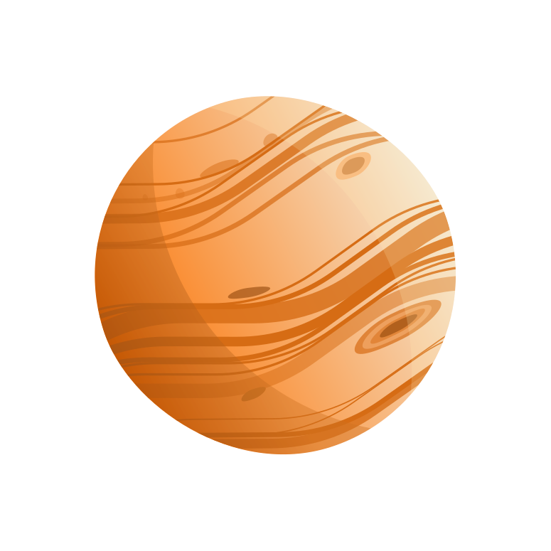
    

 

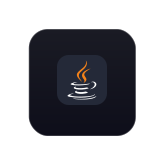
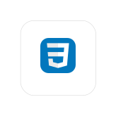

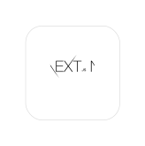
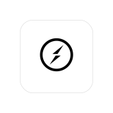
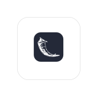

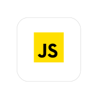
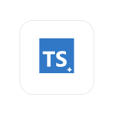
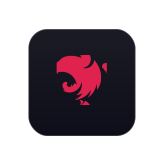

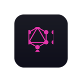
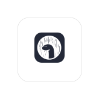
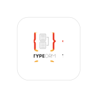

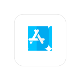
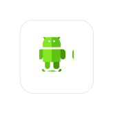

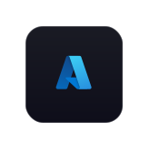
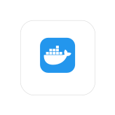
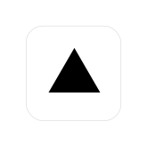

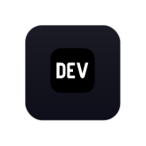
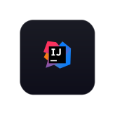

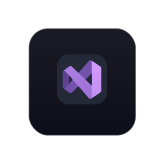
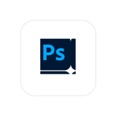
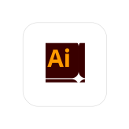
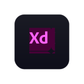
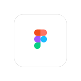
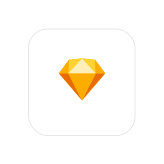

    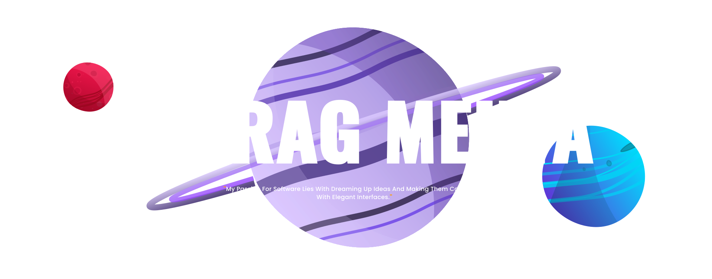
    

        
chiragmehta900@gmail.com

        
    

[//]: # ()

