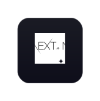
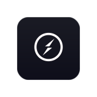
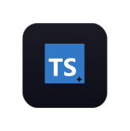
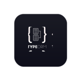
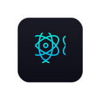
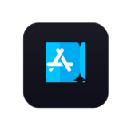
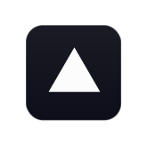
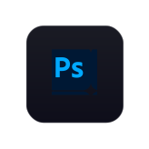
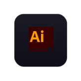
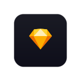

Hi, I'm [Chirag Mehta](https://chiragresume.vercel.app/), a passionate self-taught Front-End web developer and a freelance software engineer from India. My passion for software lies with dreaming up ideas and making them come true with elegant interfaces. I take great care in the experience, architecture, and code quality of the things I build.

I am also an open-source enthusiast and maintainer. I learned a lot from the open-source community and I love how collaboration and knowledge sharing happened through open-source.

 Ask me about anything, I am happy to help;  
 How to reach me: chiragmehta900@gmail.com  
 Resume

 
 
 

 
 
 

    
    
    
    
    
    
    
    
    
    
    
    
    
    
    
    
    
    
    
    
    
    
    
    
    
    
    
    
    
    
    
    
    

[//]: # ()

